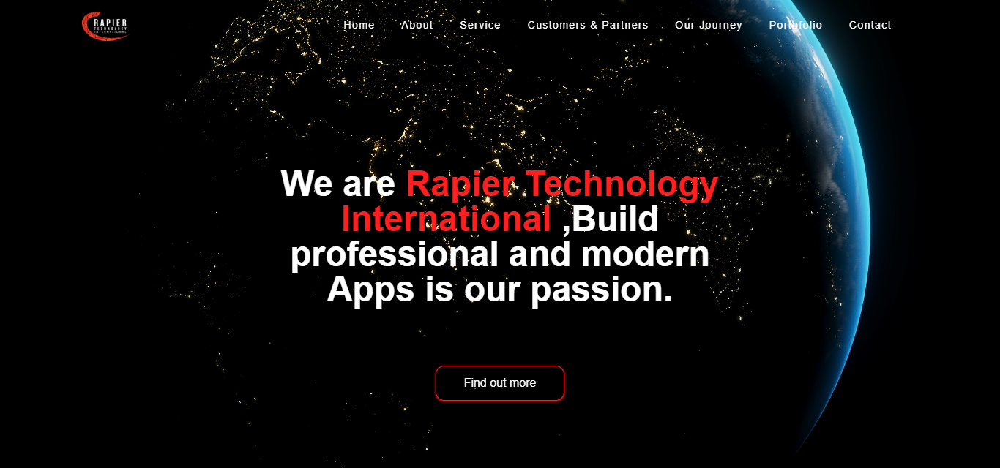

# 🌐 Rapier Technology International



Website company profile modern yang dibuat untuk menampilkan identitas, layanan, perjalanan perusahaan, dan portofolio dari **Rapier Technology International**.

---

## 🚀 Live Demo

🔗 [https://noveryanproject.github.io/company-profile-rapier.github.io/](https://noveryanproject.github.io/company-profile-rapier.github.io/)

---

## ✨ Features

* 🎨 Modern UI Design
* ⚡ Fast & Responsive
* 🌍 Company Profile Landing Page
* 📱 Mobile Friendly
* 🧑‍💻 Interactive Navigation
* 💼 Portfolio Section
* 📞 Contact Section
* 🌌 Hero Section dengan background bumi cinematic

---

## 🛠️ Tech Stack

| Technology   | Description             |
| ------------ | ----------------------- |
| HTML5        | Website structure       |
| Tailwind CSS | Styling framework       |
| CSS3         | Additional styling      |
| JavaScript   | Interaction & animation |
| GitHub Pages | Deployment              |

---

## 📂 Project Structure

```bash
company-profile-rapier.github.io/
│
├── dist/
├── node_modules/
├── public/
├── src/
│
├── index.html
├── package.json
├── package-lock.json
├── tailwind.config.js
└── README.md
```

---

## ⚙️ Installation

### 1. Clone Repository

```bash
git clone https://github.com/noveryanproject/company-profile-rapier.github.io.git
```

### 2. Open Project Folder

```bash
cd company-profile-rapier.github.io
```

### 3. Install Dependencies

```bash
npm install
```

### 4. Run Tailwind CSS

```bash
npx tailwindcss -i ./src/input.css -o ./public/output.css --watch
```

---

## 🎯 Sections

* Home
* About
* Service
* Customers & Partners
* Our Journey
* Portfolio
* Contact

---

## 💡 Purpose

Project ini dibuat untuk:

* Company branding
* Menampilkan layanan perusahaan
* Media promosi digital
* Modern web presence

---

## 📬 Contact

Jika ingin bekerja sama atau memiliki pertanyaan:

* 📧 Email: [noveryanproject@gmail.com](mailto:noveryanproject@gmail.com)
* 💻 GitHub: [https://github.com/noveryanproject](https://github.com/noveryanproject)

---

## 🚀 Future Improvements

* [ ] Dark Mode
* [ ] Animation Enhancement
* [ ] Backend Integration
* [ ] Contact Form API
* [ ] CMS Integration

---

## ⭐ Support

Jika kamu menyukai project ini:

* Beri ⭐ pada repository
* Fork untuk inspirasi project kamu

---

## 📝 License

Project ini dibuat untuk kebutuhan pembelajaran dan pengembangan portfolio.

---

> Build professional and modern digital experiences 🚀

